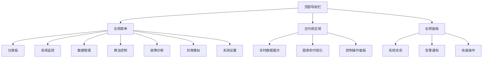
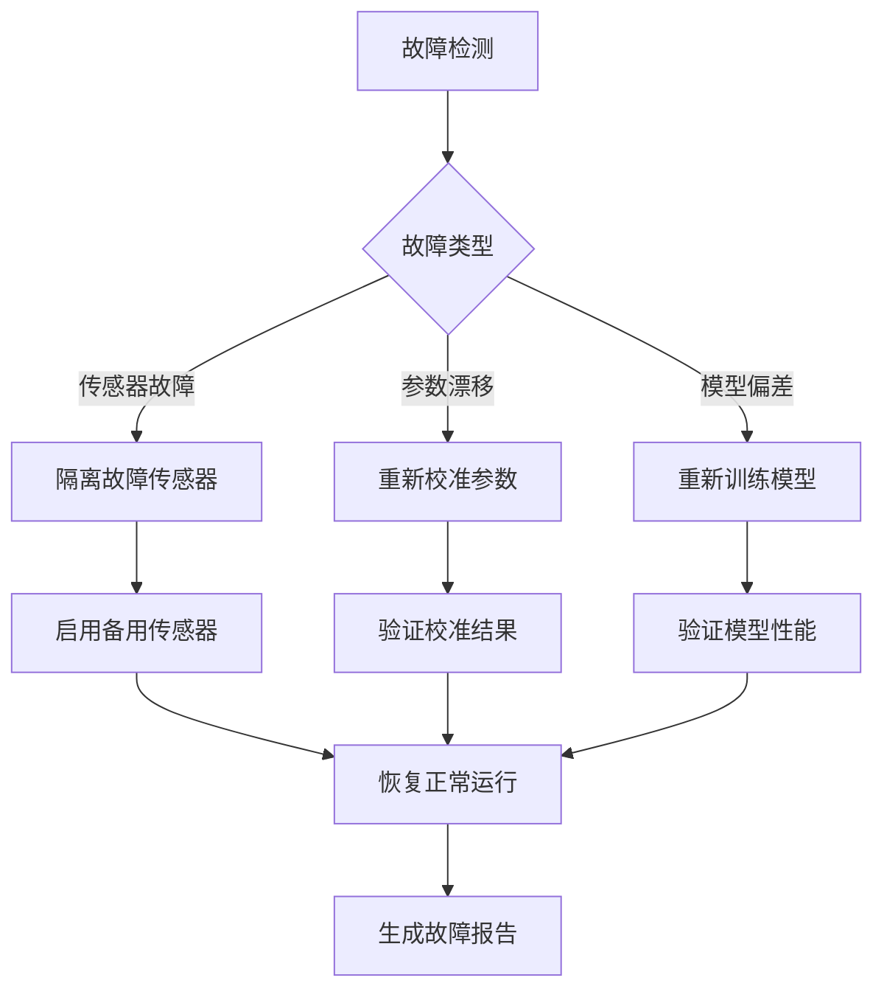

# 数字孪生水力系统 - 用户操作手册

## 文档概览

本文档为数字孪生水力系统的最终用户提供详细的操作指南、故障排除方法和最佳实践建议。无论您是系统操作员、工程师还是管理员，都能通过本手册快速掌握系统的使用方法并解决常见问题。

## 目录

1. [快速入门](#快速入门)
2. [系统界面详解](#系统界面详解)
3. [核心功能操作](#核心功能操作)
4. [监控与告警](#监控与告警)
5. [数据管理](#数据管理)
6. [系统配置](#系统配置)
7. [故障排除指南](#故障排除指南)
8. [最佳实践](#最佳实践)

---

## 快速入门

### 系统访问

#### 🌐 Web界面访问
1. 打开浏览器，访问系统地址：`http://your-domain.com`
2. 在登录页面输入用户名和密码
3. 点击"登录"按钮进入系统主界面

#### 📱 移动端访问
1. 下载并安装移动端应用
2. 输入服务器地址和登录凭据
3. 系统会自动同步数据和配置

### 首次登录设置

#### 用户配置
```yaml
默认账户:
  - 管理员: admin / admin123
  - 操作员: operator / operator123
  - 观察员: viewer / viewer123

首次登录建议:
  1. 修改默认密码
  2. 配置个人偏好设置
  3. 熟悉界面布局
  4. 检查系统状态
```

#### 权限说明
- **管理员**: 完全访问权限，可以配置系统参数
- **操作员**: 可以监控和控制系统，但不能修改配置
- **观察员**: 只能查看数据和报表，无控制权限

### 界面概览

#### 主要区域


---

## 系统界面详解

### 主仪表板

#### 📊 实时监控面板
主仪表板提供系统整体状况的实时概览：

**关键指标区域**
- 🌊 **水位状态**: 显示各监测点的实时水位
- 💧 **流量监控**: 展示系统流量变化趋势
- 🎯 **模型精度**: AI模型的预测准确率
- ⚡ **系统健康**: 整体系统运行状态

**操作快捷键**
```
F5 / Ctrl+R  : 刷新数据
Ctrl+D       : 切换到详细视图
Ctrl+M       : 打开监控面板
Ctrl+A       : 查看告警列表
Esc          : 返回主界面
```

#### 🎛️ 控制面板
位于界面右侧，提供快速操作功能：

**闸门控制**
- 滑块调节：拖动滑块调整闸门开度
- 数值输入：直接输入精确开度值
- 预设位置：选择常用的预设开度

**紧急操作**
- 🚨 **紧急停止**: 立即停止所有自动操作
- 🔒 **安全锁定**: 锁定关键设备防止误操作
- 📞 **呼叫支持**: 快速联系技术支持

### 系统监控界面

#### 📈 实时数据图表
**时序数据展示**
- 水位变化曲线：展示各测点水位历史数据
- 流量分布图：显示系统内流量分布情况
- 设备状态面板：实时显示设备运行状态

**数据操作**
```
操作方法:
  - 鼠标滚轮: 缩放时间轴
  - 拖拽: 平移查看历史数据
  - 双击: 重置到当前时间
  - 右键: 打开数据导出菜单
```

#### 🗺️ 3D可视化界面
**3D场景操作**
- **视角控制**: 鼠标拖拽旋转视角
- **缩放**: 滚轮缩放或触摸手势
- **漫游**: 按住Shift键拖拽平移
- **重置**: 点击"重置视角"按钮

**交互功能**
- 点击设备查看详细信息
- 拖拽调节闸门开度
- 实时水流动画显示
- 传感器数据悬浮显示

---

## 核心功能操作

### 🌊 水力仿真运行

#### 启动仿真
1. 进入"仿真模拟"页面
2. 选择仿真场景：
   - 正常运行模式
   - 参数估计模式
   - 故障诊断模式
3. 设置仿真参数：
   ```yaml
   仿真时长: 默认60分钟
   时间步长: 1秒
   数据保存: 是/否
   ```
4. 点击"开始仿真"按钮

#### 仿真控制
**运行中操作**
- ⏸️ **暂停**: 暂停仿真但保持状态
- ⏹️ **停止**: 停止仿真并重置状态
- ⏭️ **步进**: 手动推进仿真步骤
- 📊 **查看**: 切换不同的数据视图

**实时调节**
```python
# 示例：调节上游流量
upstream_flow = 15.0  # m³/s
system.set_upstream_flow(upstream_flow)

# 示例：调节闸门开度
gate_opening = 0.75  # 75%开度
system.set_gate_opening(gate_id="gate_001", opening=gate_opening)
```

### 🎯 参数辨识与估计

#### EKF状态估计
**启动步骤**
1. 选择"算法控制" → "扩展卡尔曼滤波"
2. 配置初始参数：
   ```yaml
   初始状态:
     水位: [2.0, 2.1, 2.2]  # 各断面初始水位
     流量: [10.0, 11.0, 12.0]  # 各断面初始流量
   
   协方差矩阵:
     过程噪声: 0.01
     观测噪声: 0.1
   
   估计参数:
     - 曼宁糙率系数 (n)
     - 河床坡度 (S0)
   ```
3. 点击"启动估计"开始参数辨识

#### RLS递归估计
**配置选项**
```yaml
算法参数:
  遗忘因子: 0.95  # 范围: 0.9-0.999
  初始协方差: 1000  # 较大值提供更快收敛
  收敛阈值: 1e-6
  最大迭代: 1000
```

**监控指标**
- 参数收敛曲线
- 估计误差变化
- 算法收敛状态
- 预测精度评估

### 🔍 故障检测与诊断

#### 传感器故障检测
**自动检测**
系统会自动监控以下故障类型：
- 📊 **数据异常**: 超出正常范围的读数
- 📡 **通信故障**: 传感器连接中断
- 🔋 **设备故障**: 传感器硬件问题
- 📈 **数据质量**: 噪声过大或数据缺失

**手动检测**
1. 进入"故障诊断"页面
2. 选择要检测的传感器
3. 点击"开始检测"
4. 查看检测结果和建议

#### 故障处理流程


---

## 监控与告警

### 📢 告警系统

#### 告警级别
- 🔴 **紧急**: 系统安全威胁，需要立即处理
- 🟠 **严重**: 重要功能受影响，需要尽快处理
- 🟡 **警告**: 潜在问题，需要关注
- 🔵 **信息**: 状态变化通知

#### 告警配置
**阈值设置**
```yaml
水位告警:
  低水位警告: < 0.5m
  低水位严重: < 0.3m
  高水位警告: > 4.0m
  高水位严重: > 4.5m

流量告警:
  低流量警告: < 5 m³/s
  高流量警告: > 20 m³/s
  流量异常: 变化率 > 50%/min

系统性能:
  CPU使用率: > 85%
  内存使用率: > 90%
  响应时间: > 200ms
```

#### 告警处理
**查看告警**
1. 点击顶部告警图标 🔔
2. 查看告警列表和详情
3. 按严重程度或时间排序

**处理告警**
```
操作选项:
  ✅ 确认告警 - 标记为已知
  🔇 静默告警 - 临时关闭
  📝 添加注释 - 记录处理过程
  🔄 手动恢复 - 触发恢复操作
```

### 📊 监控仪表板

#### 自定义监控面板
**添加监控项**
1. 点击"添加面板"按钮
2. 选择监控指标类型
3. 配置显示参数：
   ```yaml
   面板类型:
     - 折线图: 时序数据展示
     - 仪表盘: 当前状态显示
     - 表格: 详细数据列表
     - 地图: 地理位置信息
   
   更新频率:
     - 实时: 1秒更新
     - 快速: 5秒更新
     - 正常: 30秒更新
     - 慢速: 5分钟更新
   ```

#### 报告生成
**自动报告**
- 📅 **日报**: 每日运行状况总结
- 📅 **周报**: 周运行趋势分析
- 📅 **月报**: 月度性能评估
- 📅 **年报**: 年度运行统计

**手动报告**
1. 选择报告时间范围
2. 选择包含的数据类型
3. 选择报告格式 (PDF/Excel/Word)
4. 点击"生成报告"

---

## 数据管理

### 📂 数据查询与导出

#### 历史数据查询
**查询步骤**
1. 进入"数据管理"页面
2. 设置查询条件：
   ```yaml
   时间范围:
     开始时间: 2024-01-01 00:00:00
     结束时间: 2024-01-31 23:59:59
   
   数据类型:
     - 传感器数据
     - 模型计算结果
     - 系统状态日志
     - 告警记录
   
   传感器选择:
     - 水位传感器: WL001, WL002, WL003
     - 流量传感器: FL001, FL002
     - 压力传感器: PR001
   ```
3. 点击"查询"获取结果

#### 数据导出
**支持格式**
- 📊 **Excel (.xlsx)**: 便于后续分析
- 📄 **CSV (.csv)**: 通用数据格式
- 🗃️ **JSON (.json)**: 程序处理格式
- 📈 **图表 (.png/.pdf)**: 可视化导出

**导出操作**
```
快捷键:
  Ctrl+E : 快速导出当前数据
  Ctrl+S : 保存查询条件
  Ctrl+L : 加载保存的查询
```

### 🗄️ 数据备份与恢复

#### 自动备份
系统每日自动备份重要数据：
- **时序数据**: 传感器数据和计算结果
- **配置数据**: 系统参数和用户设置
- **日志数据**: 操作记录和系统日志

#### 手动备份
**创建备份**
1. 进入"系统设置" → "数据管理"
2. 选择备份内容和范围
3. 设置备份存储位置
4. 点击"创建备份"

**恢复数据**
⚠️ **注意**: 数据恢复需要管理员权限
1. 选择要恢复的备份文件
2. 确认恢复范围和时间点
3. 输入管理员密码确认
4. 系统将自动重启并恢复数据

---

## 故障排除指南

### ❗ 常见问题及解决方案

#### 🌐 系统连接问题

**问题**: 无法访问Web界面
**症状**: 浏览器显示"无法连接到服务器"

**解决步骤**:
1. **检查网络连接**
   ```bash
   # 测试网络连通性
   ping your-server-ip
   
   # 检查端口是否开放
   telnet your-server-ip 80
   ```

2. **检查服务状态**
   ```bash
   # 检查Web服务状态
   sudo systemctl status nginx
   sudo systemctl status hydraulic-web
   
   # 重启服务
   sudo systemctl restart nginx
   sudo systemctl restart hydraulic-web
   ```

3. **检查防火墙设置**
   ```bash
   # 检查防火墙规则
   sudo ufw status
   
   # 开放必要端口
   sudo ufw allow 80
   sudo ufw allow 443
   ```

**问题**: 登录后页面空白或加载缓慢
**可能原因**: 前端资源加载失败或数据库连接问题

**解决方案**:
```javascript
// 1. 清除浏览器缓存
// 按F12打开开发者工具，右键刷新按钮选择"清空缓存并硬性重新加载"

// 2. 检查API连接
fetch('/api/v1/health')
  .then(response => response.json())
  .then(data => console.log('API状态:', data))
  .catch(error => console.error('API连接失败:', error));

// 3. 检查控制台错误
// 在开发者工具的Console面板查看错误信息
```

#### 📊 数据异常问题

**问题**: 传感器数据显示异常或缺失
**症状**: 图表中出现断点、异常值或"无数据"提示

**诊断步骤**:
1. **检查传感器状态**
   ```python
   # 查看传感器连接状态
   sensor_status = system.get_sensor_status()
   for sensor_id, status in sensor_status.items():
       print(f"传感器 {sensor_id}: {status['status']} - {status['last_update']}")
   ```

2. **验证数据完整性**
   ```sql
   -- 检查数据缺失
   SELECT sensor_id, COUNT(*) as data_count, 
          MIN(timestamp) as first_data, 
          MAX(timestamp) as last_data
   FROM sensor_data 
   WHERE timestamp >= NOW() - INTERVAL '1 hour'
   GROUP BY sensor_id;
   ```

3. **重新校准传感器**
   ```yaml
   校准步骤:
     1. 进入"系统设置" → "传感器管理"
     2. 选择异常传感器
     3. 点击"重新校准"
     4. 按照提示完成校准流程
   ```

**问题**: 模型计算结果不准确
**症状**: 预测值与实测值偏差过大

**解决方案**:
1. **检查输入数据质量**
   ```python
   # 数据质量检查
   data_quality = system.check_data_quality()
   if data_quality['completeness'] < 0.95:
       print("数据完整性不足，需要数据清洗")
   
   if data_quality['accuracy'] < 0.9:
       print("数据准确性不足，需要传感器校准")
   ```

2. **重新训练模型**
   ```python
   # 重新训练AI模型
   model_trainer = system.get_model_trainer()
   model_trainer.retrain_with_recent_data(days=30)
   model_trainer.validate_model_performance()
   ```

3. **调整模型参数**
   ```yaml
   参数调整:
     曼宁糙率: 0.030 → 0.035
     河床坡度: 0.001 → 0.0012
     边界条件: 检查上下游边界设置
   ```

#### ⚡ 性能问题

**问题**: 系统响应缓慢
**症状**: 页面加载时间超过10秒，图表更新延迟

**性能诊断**:
1. **检查系统资源**
   ```bash
   # CPU和内存使用情况
   htop
   
   # 磁盘I/O状态
   iotop
   
   # 网络连接状态
   netstat -tuln
   ```

2. **数据库性能优化**
   ```sql
   -- 检查慢查询
   SELECT query, mean_time, calls 
   FROM pg_stat_statements 
   ORDER BY mean_time DESC 
   LIMIT 10;
   
   -- 重建索引
   REINDEX DATABASE hydraulic_system;
   ```

3. **清理历史数据**
   ```python
   # 清理90天前的详细数据
   data_manager = system.get_data_manager()
   data_manager.cleanup_old_data(days=90, keep_summary=True)
   ```

### 🚨 紧急故障处理

#### 系统崩溃恢复
**症状**: 系统完全无响应或服务异常终止

**紧急恢复步骤**:
1. **立即行动**
   ```bash
   # 检查核心服务状态
   sudo systemctl status hydraulic-core
   sudo systemctl status postgresql
   sudo systemctl status redis
   
   # 重启核心服务
   sudo systemctl restart hydraulic-core
   ```

2. **数据保护**
   ```bash
   # 创建紧急备份
   sudo -u postgres pg_dump hydraulic_system > /backup/emergency_$(date +%Y%m%d_%H%M%S).sql
   
   # 备份配置文件
   cp -r /etc/hydraulic-system/ /backup/config_$(date +%Y%m%d_%H%M%S)/
   ```

3. **故障分析**
   ```bash
   # 查看系统日志
   journalctl -u hydraulic-core -f
   
   # 检查错误日志
   tail -f /var/log/hydraulic-system/error.log
   ```

---

## 最佳实践

### 🎯 日常操作建议

#### 系统监控
**每日检查清单**
- [ ] 检查系统整体健康状态
- [ ] 查看当日告警记录
- [ ] 验证关键传感器数据
- [ ] 检查模型预测精度
- [ ] 查看系统性能指标

**定期维护**
```yaml
每周任务:
  - 检查数据备份完整性
  - 清理临时文件和日志
  - 更新系统安全补丁
  - 校准关键传感器

每月任务:
  - 全面性能评估
  - 数据库优化和维护
  - 模型性能重新评估
  - 用户权限审核

每季度任务:
  - 系统架构评估
  - 硬件设备检查
  - 灾难恢复演练
  - 用户培训更新
```

#### 数据管理
**数据质量保证**
1. **实时监控**
   - 设置数据质量告警
   - 监控数据完整性
   - 检测异常值

2. **定期清理**
   ```python
   # 每周执行数据清理
   data_manager.cleanup_duplicate_data()
   data_manager.remove_invalid_records()
   data_manager.compress_old_data(days=30)
   ```

3. **备份策略**
   ```yaml
   备份频率:
     实时数据: 每小时增量备份
     配置数据: 每日全量备份
     历史数据: 每周压缩备份
   
   存储策略:
     本地存储: 保留30天
     远程存储: 保留1年
     归档存储: 永久保存摘要数据
   ```

### 🔒 安全最佳实践

#### 访问控制
**密码策略**
- 密码长度至少8位
- 包含大小写字母、数字和特殊字符
- 每90天强制更新密码
- 不得重复使用最近5次的密码

**会话管理**
```yaml
安全配置:
  会话超时: 30分钟无操作自动退出
  并发登录: 同一用户最多3个会话
  IP限制: 可配置允许的IP地址范围
  双因子认证: 支持手机验证码或硬件令牌
```

#### 操作审计
**审计内容**
- 所有用户登录和退出
- 关键参数的修改操作
- 系统配置变更
- 数据导出和备份操作

**审计查看**
```sql
-- 查看用户操作记录
SELECT user_id, action, timestamp, ip_address, details 
FROM audit_log 
WHERE timestamp >= CURRENT_DATE - INTERVAL '7 days'
ORDER BY timestamp DESC;
```

---

## FAQ常见问题

### 🤔 用户操作问题

**Q1: 忘记登录密码怎么办？**
A: 
1. 点击登录页面的"忘记密码"链接
2. 输入注册邮箱地址
3. 检查邮箱中的重置密码邮件
4. 按照邮件指引重置密码
5. 如无法接收邮件，请联系系统管理员

**Q2: 为什么看不到某些菜单选项？**
A: 这通常是权限限制导致的：
- 检查您的用户角色（管理员/操作员/观察员）
- 不同角色有不同的功能访问权限
- 如需要更高权限，请联系系统管理员

**Q3: 如何导出历史数据？**
A: 
1. 进入"数据管理"页面
2. 设置查询时间范围和数据类型
3. 点击"导出"按钮
4. 选择导出格式（Excel/CSV/JSON）
5. 下载生成的文件

**Q4: 3D可视化界面操作卡顿怎么解决？**
A: 
1. 检查浏览器硬件加速是否开启
2. 关闭其他占用GPU的应用程序
3. 降低3D场景的渲染质量
4. 使用Chrome或Firefox最新版本浏览器

### 📊 数据相关问题

**Q5: 传感器数据为什么会有延迟？**
A: 数据延迟可能由以下原因引起：
- 网络连接质量问题
- 传感器设备响应时间
- 数据处理和验证流程
- 系统负载过高
正常情况下延迟应在5秒以内

**Q6: 模型预测精度突然下降怎么办？**
A: 
1. 检查最近是否有系统参数变更
2. 验证输入数据的质量和完整性
3. 检查是否有异常的外部干扰
4. 考虑重新训练模型
5. 如问题持续，请联系技术支持

**Q7: 如何判断告警是否为误报？**
A: 
1. 查看告警详细信息和触发条件
2. 对比历史数据验证异常性
3. 检查相关传感器的状态
4. 查看是否有手动操作记录
5. 必要时进行现场验证

### ⚙️ 系统配置问题

**Q8: 如何添加新的传感器？**
A: （需要管理员权限）
1. 进入"系统设置" → "传感器管理"
2. 点击"添加传感器"
3. 填写传感器基本信息
4. 配置数据采集参数
5. 进行连接测试
6. 保存配置并启用

**Q9: 告警阈值如何调整？**
A: 
1. 进入"系统设置" → "告警配置"
2. 选择要调整的告警规则
3. 修改阈值参数
4. 设置告警延迟时间
5. 测试告警规则
6. 保存配置

**Q10: 系统升级后配置丢失怎么办？**
A: 
1. 检查配置备份文件是否存在
2. 联系系统管理员恢复配置
3. 如无备份，需要重新配置
4. 建议定期导出配置文件作为备份

### 🔧 技术支持

**Q11: 遇到未知错误怎么办？**
A: 
1. 记录错误发生的具体时间和操作
2. 截图保存错误信息
3. 检查浏览器控制台的错误日志
4. 联系技术支持并提供详细信息

**Q12: 如何联系技术支持？**
A: 
- **在线支持**: 点击右下角的"在线客服"按钮
- **邮件支持**: support@hydraulic-system.com
- **电话支持**: 400-XXX-XXXX (工作时间：9:00-18:00)
- **紧急支持**: 提供24小时紧急联系方式

**Q13: 系统维护期间如何操作？**
A: 
- 系统维护时会提前通知用户
- 维护期间系统可能暂时无法访问
- 重要数据仍会继续采集和存储
- 维护完成后系统会自动恢复服务

---

## 联系我们

### 📞 技术支持

**工作时间支持** (周一至周五 9:00-18:00)
- 电话：400-XXX-XXXX
- 邮箱：support@hydraulic-system.com
- 在线客服：系统右下角客服按钮

**紧急支持** (7×24小时)
- 紧急热线：138-XXXX-XXXX
- 紧急邮箱：emergency@hydraulic-system.com

### 📚 学习资源

**在线文档**
- 用户手册：http://docs.hydraulic-system.com/user-manual
- API文档：http://docs.hydraulic-system.com/api
- 视频教程：http://docs.hydraulic-system.com/videos

**培训服务**
- 在线培训：每月定期举办用户培训
- 现场培训：可安排工程师上门培训
- 认证考试：提供系统操作员认证

### 📋 反馈建议

我们重视每一位用户的意见和建议：
- 功能建议：feedback@hydraulic-system.com
- 问题反馈：issues@hydraulic-system.com
- 用户体验：ux@hydraulic-system.com

---

## 总结

数字孪生水力系统为用户提供了强大而友好的操作界面，通过本操作手册，您应该能够：

### 核心能力掌握
✅ **系统操作**: 熟练使用各项功能模块  
✅ **数据管理**: 掌握数据查询、导出和备份  
✅ **故障处理**: 识别并解决常见问题  
✅ **安全操作**: 遵循最佳安全实践  
✅ **日常维护**: 执行定期检查和维护任务  

### 持续改进建议
- 定期阅读系统更新日志
- 参与用户培训和认证
- 关注最佳实践分享
- 积极反馈使用体验

### 记住要点
1. **安全第一**: 始终遵循安全操作规程
2. **数据宝贵**: 定期备份重要数据
3. **预防为主**: 主动监控，及早发现问题
4. **持续学习**: 跟上系统功能更新
5. **团队协作**: 与同事分享经验和最佳实践

希望本手册能帮助您更好地使用数字孪生水力系统，提高工作效率并确保系统稳定运行。如有任何问题，请随时联系我们的技术支持团队。

---

**开发团队**: 数字孪生系统团队  
**文档版本**: v1.0  
**最后更新**: 2024年  
**文档状态**: 完整版