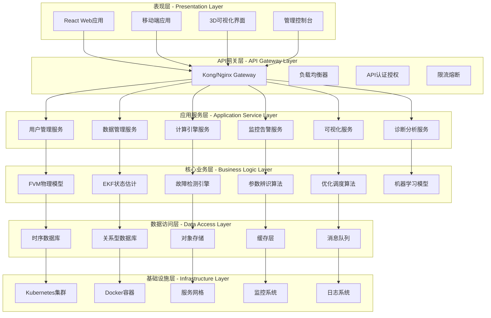
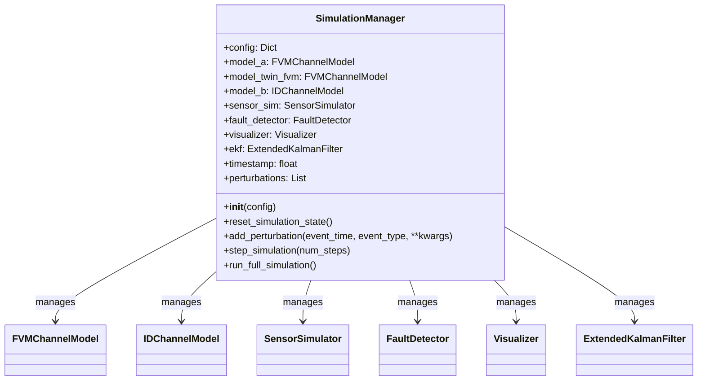
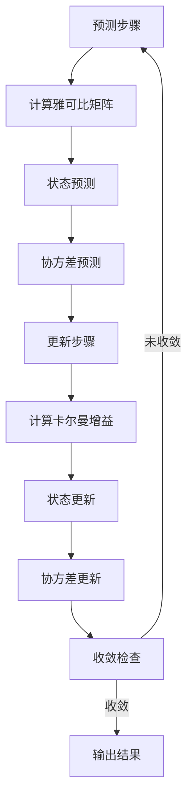
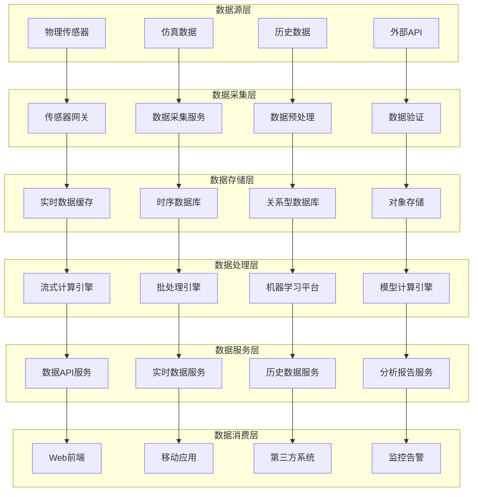

# 数字孪生水力系统 - 系统架构和设计文档

## 文档概览

本文档详细描述了数字孪生水力系统的整体架构设计、技术选型、组件设计、数据流分析和关键设计决策，为系统开发、部署和维护提供全面的技术指导。

## 目录

1. [系统概述](#系统概述)
2. [整体架构设计](#整体架构设计)
3. [技术栈与工具链](#技术栈与工具链)
4. [核心组件设计](#核心组件设计)
5. [数据流与交互设计](#数据流与交互设计)
6. [微服务架构](#微服务架构)
7. [部署架构](#部署架构)
8. [安全架构](#安全架构)
9. [监控与运维架构](#监控与运维架构)
10. [性能与扩展性设计](#性能与扩展性设计)

---

## 系统概述

### 系统定位

数字孪生水力系统是一个企业级的智能化水力监控和管理平台，通过数字孪生技术实现物理水力系统的精确建模、实时监控、智能诊断和预测性维护。系统结合了高保真物理建模、先进控制算法、机器学习技术和现代化软件架构。

### 核心价值

- **精确建模**: 基于FVM有限体积法的高保真物理模型
- **实时监控**: 毫秒级的系统状态监控和数据采集
- **智能诊断**: AI驱动的故障检测和预测性维护
- **自动化运维**: 智能告警和自愈机制
- **可视化展示**: 3D可视化和实时数据仪表板

### 应用场景

- 水利工程智能化管理
- 城市排水系统监控
- 工业水处理过程控制
- 环境水质监测
- 防洪预警系统

---

## 整体架构设计

### 架构理念

系统采用分层架构设计，遵循"松耦合、高内聚"的设计原则，通过微服务架构实现各功能模块的独立部署和扩展。



### 系统层次结构

#### 1. 表现层 (Presentation Layer)
- **Web前端**: React + TypeScript + Vite现代化单页应用
- **移动端**: React Native跨平台移动应用
- **3D可视化**: Three.js实时三维可视化
- **管理控制台**: 系统管理和运维界面

#### 2. API网关层 (API Gateway Layer)
- **API网关**: Kong/Nginx统一入口
- **负载均衡**: 智能流量分发
- **认证授权**: JWT + RBAC权限控制
- **限流熔断**: 系统保护机制

#### 3. 应用服务层 (Application Service Layer)
- **用户管理服务**: 用户认证、权限管理
- **数据管理服务**: 数据CRUD、质量控制
- **计算引擎服务**: 模型计算、算法执行
- **监控告警服务**: 实时监控、智能告警
- **可视化服务**: 图表生成、报告输出
- **诊断分析服务**: 故障诊断、性能分析

#### 4. 核心业务层 (Business Logic Layer)
- **FVM物理模型**: 高保真水力学模型
- **EKF状态估计**: 扩展卡尔曼滤波
- **故障检测引擎**: AI故障识别
- **参数辨识算法**: RLS递归最小二乘
- **优化调度算法**: 多目标优化
- **机器学习模型**: 深度学习预测

#### 5. 数据访问层 (Data Access Layer)
- **时序数据库**: InfluxDB/TimescaleDB
- **关系型数据库**: PostgreSQL
- **对象存储**: MinIO/S3
- **缓存层**: Redis集群
- **消息队列**: RabbitMQ/Kafka

#### 6. 基础设施层 (Infrastructure Layer)
- **容器编排**: Kubernetes集群
- **容器运行**: Docker容器
- **服务网格**: Istio服务治理
- **监控系统**: Prometheus + Grafana
- **日志系统**: ELK Stack

---

## 技术栈与工具链

### 前端技术栈

```yaml
前端框架:
  - React 18.x (用户界面框架)
  - TypeScript 5.x (类型安全语言)
  - Vite 4.x (构建工具)
  - React Router (路由管理)
  - Zustand (状态管理)

UI组件库:
  - Tailwind CSS (样式框架)
  - Headless UI (无样式组件)
  - Heroicons (图标库)
  - Framer Motion (动画库)

数据可视化:
  - Three.js (3D图形库)
  - React Three Fiber (React 3D渲染)
  - ECharts (图表库)
  - D3.js (数据驱动可视化)

开发工具:
  - ESLint (代码检查)
  - Prettier (代码格式化)
  - Jest (单元测试)
  - Cypress (端到端测试)
```

### 后端技术栈

```yaml
编程语言:
  - Python 3.9+ (主要开发语言)
  - Go 1.19+ (高性能服务)
  - JavaScript/Node.js (部分微服务)

Web框架:
  - FastAPI (Python API框架)
  - Flask (轻量级Web框架)
  - Gin (Go Web框架)
  - Express.js (Node.js框架)

数据库:
  - PostgreSQL 14+ (关系型数据库)
  - InfluxDB 2.x (时序数据库)
  - Redis 6.x (缓存数据库)
  - MongoDB (文档数据库)

消息队列:
  - RabbitMQ (消息代理)
  - Apache Kafka (流处理)
  - Celery (任务队列)

科学计算:
  - NumPy (数值计算)
  - SciPy (科学计算)
  - Pandas (数据分析)
  - Scikit-learn (机器学习)
  - TensorFlow/PyTorch (深度学习)
```

### 基础设施技术栈

```yaml
容器化:
  - Docker (容器技术)
  - Docker Compose (本地编排)
  - Kubernetes (生产编排)
  - Helm (包管理)

服务网格:
  - Istio (服务治理)
  - Envoy (代理网关)
  - Consul (服务发现)

监控运维:
  - Prometheus (指标监控)
  - Grafana (可视化监控)
  - AlertManager (告警管理)
  - Jaeger (链路追踪)
  - ELK Stack (日志分析)

CI/CD:
  - GitHub Actions (持续集成)
  - GitLab CI (代码管理)
  - ArgoCD (持续部署)
  - Tekton (云原生CI/CD)

云平台:
  - AWS/Azure/阿里云 (公有云)
  - OpenStack (私有云)
  - VMware vSphere (虚拟化)
```

---

## 核心组件设计

### 1. 仿真管理器 (SimulationManager)

#### 组件职责
- 系统协调中枢，管理所有核心组件
- 仿真流程控制和状态管理
- 数据流编排和异常处理

#### 核心接口
```python
class SimulationManager:
    def __init__(self, config: Dict[str, Any])
    def reset_simulation_state(self) -> None
    def add_perturbation(self, event_time: float, event_type: str, **kwargs) -> None
    def step_simulation(self, num_steps: int = 1) -> Dict[str, Any]
    def run_full_simulation(self) -> Dict[str, Any]
    def get_system_status(self) -> Dict[str, Any]
```

#### 架构模式


### 2. FVM物理模型 (FVMChannelModel)

#### 组件职责
- 高保真水力学物理建模
- 一维圣维南方程数值求解
- 边界条件处理和状态更新

#### 数学模型
```
连续性方程: ∂A/∂t + ∂Q/∂x = 0
动量方程: ∂Q/∂t + ∂(Q²/A)/∂x + gA∂h/∂x = -gA(S_f - S_0)

其中:
- A: 截面积
- Q: 流量
- h: 水深
- S_f: 摩擦坡度
- S_0: 底坡
```

#### 核心算法
```python
class FVMChannelModel:
    def step(self, dt: float, upstream_bc: Dict, downstream_bc: Dict) -> None
    def _apply_boundary_conditions(self, upstream_bc: Dict, downstream_bc: Dict) -> None
    def _apply_hll_solver(self, dt: float) -> None
    def _calculate_source_terms(self, dt: float) -> None
    def _update_depth_from_area(self) -> None
    def get_state(self) -> Dict[str, np.ndarray]
```

### 3. 扩展卡尔曼滤波器 (ExtendedKalmanFilter)

#### 组件职责
- 非线性系统状态估计
- 参数在线辨识
- 不确定性量化

#### 算法流程


#### 核心接口
```python
class ExtendedKalmanFilter:
    def predict(self, dt: float, u: np.ndarray) -> None
    def update(self, z: np.ndarray) -> None
    def _calculate_F_jacobian_numerical(self, dt: float, u: np.ndarray) -> np.ndarray
    def _calculate_H_jacobian(self) -> np.ndarray
    def get_state_estimate(self) -> Tuple[np.ndarray, np.ndarray]
```

### 4. 故障检测系统 (FaultDetector)

#### 组件职责
- 实时故障检测和诊断
- 异常模式识别
- 故障严重程度评估

#### 检测算法
```python
class FaultDetector:
    def detect_sensor_faults(self, readings: Dict, true_values: Dict) -> List[Dict]
    def detect_parameter_drift(self, estimated_params: Dict) -> List[Dict]
    def detect_model_degradation(self, residuals: np.ndarray) -> List[Dict]
    def _chi_square_test(self, residuals: np.ndarray) -> bool
    def _cusum_test(self, values: np.ndarray) -> bool
```

---

## 数据流与交互设计

### 数据流架构



### 数据模型设计

#### 时序数据模型
```sql
-- 传感器数据表
CREATE TABLE sensor_data (
    time TIMESTAMPTZ NOT NULL,
    sensor_id VARCHAR(50) NOT NULL,
    sensor_type VARCHAR(20) NOT NULL,
    location_id VARCHAR(50) NOT NULL,
    value DOUBLE PRECISION NOT NULL,
    quality_code INTEGER DEFAULT 0,
    tags JSONB,
    PRIMARY KEY (time, sensor_id)
);

-- 模型计算结果表
CREATE TABLE model_results (
    time TIMESTAMPTZ NOT NULL,
    model_type VARCHAR(20) NOT NULL,
    location_id VARCHAR(50) NOT NULL,
    water_level DOUBLE PRECISION,
    flow_rate DOUBLE PRECISION,
    velocity DOUBLE PRECISION,
    parameters JSONB,
    PRIMARY KEY (time, model_type, location_id)
);
```

### API设计规范

#### RESTful API设计
```yaml
# 数据查询API
GET /api/v1/sensors/{sensor_id}/data
GET /api/v1/models/{model_type}/results
GET /api/v1/locations/{location_id}/status

# 控制操作API
POST /api/v1/simulation/start
POST /api/v1/simulation/stop
PUT /api/v1/gates/{gate_id}/opening

# 配置管理API
GET /api/v1/config
PUT /api/v1/config/{key}
POST /api/v1/config/validate
```

---

## 微服务架构

### 服务拆分原则

#### 业务边界划分
- **用户服务**: 用户认证、权限管理、用户资料
- **数据服务**: 数据采集、存储、查询、清洗
- **计算服务**: 模型计算、算法执行、任务调度
- **监控服务**: 实时监控、告警管理、系统健康
- **可视化服务**: 图表生成、报告输出、3D渲染
- **配置服务**: 系统配置、参数管理、版本控制

---

## 部署架构

### 容器化部署

#### Docker镜像构建
```dockerfile
# 基础镜像
FROM python:3.9-slim as base

# 生产镜像
FROM base as production
WORKDIR /app
COPY requirements.txt .
RUN pip install --no-cache-dir -r requirements.txt
COPY . .
EXPOSE 8000
CMD ["uvicorn", "main:app", "--host", "0.0.0.0", "--port", "8000"]
```

---

## 安全架构

### 认证与授权

#### JWT Token设计
```python
# JWT Payload结构
jwt_payload = {
    "sub": "user_id",                    # 用户ID
    "username": "admin",                 # 用户名
    "role": "administrator",             # 用户角色
    "permissions": [                     # 权限列表
        "read:sensors",
        "write:config",
        "admin:system"
    ],
    "iat": 1640000000,                   # 签发时间
    "exp": 1640003600,                   # 过期时间
    "aud": "hydraulic-system",           # 受众
    "iss": "auth-service"                # 签发者
}
```

---

## 监控与运维架构

### 监控体系

#### 告警规则配置
```yaml
# Prometheus告警规则
groups:
- name: hydraulic_system_alerts
  rules:
  - alert: HighWaterLevel
    expr: water_level > 4.5
    for: 30s
    labels:
      severity: critical
    annotations:
      summary: "水位过高警报"
      description: "传感器 {{ $labels.sensor_id }} 检测到水位 {{ $value }}m，超过安全阈值"
```

---

## 性能与扩展性设计

### 性能优化策略

#### 计算性能优化
```python
# GPU加速配置
import cupy as cp
import numba

@numba.cuda.jit
def fvm_cuda_kernel(U, flux, source, dt, dx):
    """CUDA内核函数优化FVM计算"""
    idx = numba.cuda.grid(1)
    if idx < U.shape[0]:
        U[idx] += dt/dx * (flux[idx] - flux[idx+1]) + dt * source[idx]
```

---

## 关键设计决策

### 技术选型决策

#### 前端框架选择: React vs Vue vs Angular
**决策**: 选择React  
**理由**:
- 生态系统成熟，第三方库丰富
- TypeScript支持良好
- Three.js集成方便
- 团队技术栈匹配

#### 数据库选择: 时序数据库选型
**决策**: InfluxDB + PostgreSQL  
**理由**:
- InfluxDB专为时序数据设计，查询性能优秀
- PostgreSQL处理关系型数据，ACID特性保证
- 混合架构满足不同数据类型需求

---

## 未来演进路线

### 短期规划 (3-6个月)
- 完善微服务拆分
- 增强监控告警体系
- 优化前端用户体验
- 提升系统性能

### 中期规划 (6-12个月)
- 引入AI/ML能力增强
- 实现边缘计算部署
- 支持多租户架构
- 增强数据分析能力

### 长期规划 (1-2年)
- 构建数字孪生平台
- 支持大规模分布式部署
- 实现自主运维能力
- 开放平台生态建设

---

## 总结

数字孪生水力系统采用现代化的分层架构设计，通过微服务、容器化、云原生等技术实现了高可用、高性能、可扩展的企业级系统。系统在保证功能完整性的同时，充分考虑了安全性、可维护性和未来发展需求。

### 架构优势

1. **模块化设计**: 组件松耦合，便于独立开发和部署
2. **技术先进**: 采用当前主流的云原生技术栈
3. **性能优化**: 多层缓存和GPU加速提升计算性能
4. **安全可靠**: 完善的安全认证和数据保护机制
5. **易于扩展**: 微服务架构支持水平扩展和功能扩展

### 关键创新点

1. **数字孪生技术**: 物理系统的精确数字化建模
2. **智能诊断**: AI驱动的故障检测和预测性维护
3. **实时可视化**: 3D可视化和实时数据展示
4. **自动化运维**: 智能告警和自愈机制
5. **云原生架构**: 容器化和微服务部署

本架构文档为系统的开发、部署和运维提供了全面的技术指导，确保系统能够满足当前需求并支持未来的发展演进。

---

**开发团队**: 数字孪生系统团队  
**文档版本**: v1.0  
**最后更新**: 2024年  
**文档状态**: 完整版